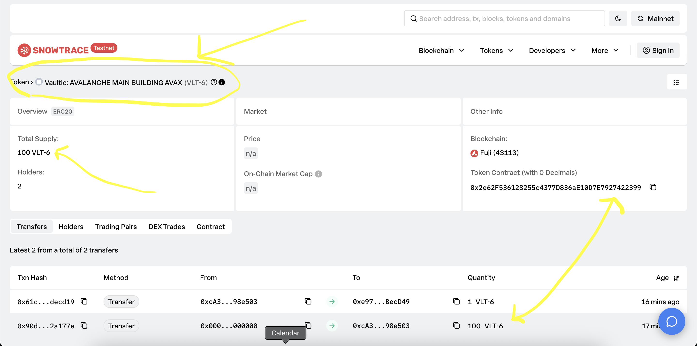

# Vaultic Trust

**Tokenize Africa's real economy.** Compliant RWA tokenization for Rwanda and Africa. Fractionalize real estate, commodities, carbon credits, and infrastructure into programmable, liquid digital assets on Avalanche.

Built with Next.js, RainbowKit, Hardhat, Wagmi, Viem, and TypeScript.

---

EXPLORER LINKS TO VERIFIED SMART CONTRACTS
---------------------------------

[[Vaultic Asset Registry Contract - Proxy]](https://testnet.snowtrace.io/address/0x7bE0137284bE5E40Af3e6b5c178C1492F62bF635)


[[Investment Manager Contract - Proxy]](https://testnet.snowtrace.io/address/0xcA3EDAfd3344f57e7180ABD051e1bF027498e503)

[[Vaultic Fractional Token Contract - Implementation]](https://testnet.snowtrace.io/token/0x4d8f5709AcD40aC1DB92A32F68DB81a1d5B1C3B9?chainid=43113)

[[Investment Manager (Token holdings && Txns)]](https://testnet.snowtrace.io/address/0xcA3EDAfd3344f57e7180ABD051e1bF027498e503/tokentxns)


## Product



- **Asset owners**: Submit real-world assets; choose whole-asset sale or fractional tokenization.
- **Investors**: Browse the marketplace and invest in whole assets or fractions; ownership is on-chain.
- **Stack**: Next.js (App Router), TailwindCSS, DaisyUI, Solidity on **Avalanche C-Chain** and Fuji testnet.

---

## How Vaultic Trust works

### Roles

- **Asset owner**
  - Submits assets (real estate, commodities, carbon, infrastructure) with valuation and documentation.
  - Chooses an ownership model:
    - **Whole** – one buyer purchases 100% of the asset.
    - **Fractional** – ERC20 shares represent pro-rata ownership.
  - Can **relist** closed whole assets:
    - As **whole** again (direct whole-asset purchase).
    - As **fractional** for a new tokenized round.

- **Investor**
  - Connects a wallet, browses the **Marketplace**, and:
    - Buys an entire **Active / Whole** asset.
    - Buys **shares** of a **Tokenized / Fractional** asset.
  - Sees positions in the **Investor** dashboard.

- **Protocol admin**
  - Owns the `VaulticAssetRegistry` and `VaulticInvestmentManager`.
  - Approves assets, tokenizes fractional assets, configures protocol fees/treasury, pauses/unpauses, and sweeps fees.

### Asset lifecycle (on-chain)

`PENDING → ACTIVE → TOKENIZED → CLOSED → (optionally) RELISTED → …`

- **PENDING**
  - Asset is registered in `VaulticAssetRegistry` by the registry owner (via the Owner dashboard).
  - Not visible for investment.
- **ACTIVE**
  - Registry owner calls `approveAsset`.
  - For **Whole** assets:
    - `InvestmentManager.purchaseWholeAsset(assetId)` lets an investor pay valuation in USDC.
  - For **Fractional** assets:
    - Protocol admin calls `InvestmentManager.tokenizeAsset` to deploy a `VaulticFractionalOwnershipToken` clone and open a pool.
- **TOKENIZED**
  - Investors purchase shares via `InvestmentManager.purchaseShares`.
  - Funding progress and share distribution are tracked on-chain.
- **CLOSED**
  - Whole assets: set when a buyer purchases 100% and ownership transfers.
  - Fractional assets: set when the pool is fully subscribed or explicitly closed.
- **RELISTED**
  - Owner of a **Closed** whole asset can:
    - `relistWholeAsset` – reopen as whole sale (state becomes **ACTIVE**, model stays **WHOLE**).
    - `relistAssetAsFractional` – mark as **RELISTED + FRACTIONAL** so the admin can tokenize a new fractional round.
  - For fractional assets, `relistAsset` lets the full token holder reclaim all shares, reset the pool, and start a new round.

### End‑to‑end user flows

- **Asset owner (high level)**
  1. Connect wallet → open `/owner`.
  2. Submit asset (metadata, valuation, whole vs fractional).
  3. Wait for protocol admin to **approve**.
  4. If fractional:
     - Admin tokenizes → asset becomes **Tokenized**, shares are available.
  5. Track sales and, if fractional, withdraw proceeds once the round closes.
  6. When a whole asset is sold and later **Closed**, the new owner can **Relist** from `/owner` or the asset detail page.

- **Investor**
  1. Connect wallet → open `/marketplace`.
  2. For **Active / Whole** assets:
     - Click **Buy whole** → `purchaseWholeAsset` is called with valuation.
  3. For **Tokenized / Fractional** assets:
     - Enter number of shares → UI:
       - Resets and sets USDC allowance.
       - Calls `purchaseShares(assetId, shareAmount, paymentAmount)`.
  4. Verify holdings in `/investor` and on-chain via the ERC20 token and registry.

- **Protocol admin**
  - From `/control-panel` (Investment Manager owner):
    - View `protocolFeeBps`, `feeTreasury`, token implementation, and `accumulatedFees`.
    - Update protocol fee and treasury.
    - Upgrade fractional token implementation.
    - Pause/unpause the Investment Manager.
    - Sweep protocol fees to the treasury.
  - From Owner dashboard as registry or Investment Manager owner:
    - Approve `PENDING` assets.
    - Tokenize fractional assets (deploy per‑asset ERC20 clones and open pools).
    - Relist fractional assets for new rounds when an investor owns 100% of the shares.

### Smart contracts (MVP)

- **`VaulticAssetRegistry` (UUPS proxy)**
  - Canonical registry of all assets.
  - Stores metadata, valuation, ownership model, and lifecycle state.
  - Enforces valid state transitions (`PENDING`, `ACTIVE`, `TOKENIZED`, `CLOSED`, `RELISTED`).
  - Records fractional tokenization and sold shares.
  - Holds a `tokenizer` address (the Investment Manager) for write operations related to investment.

- **`VaulticInvestmentManager` (UUPS proxy)**
  - Holds `TOKENIZER_ROLE` on the registry.
  - Deploys new `VaulticFractionalOwnershipToken` clones via `tokenizeAsset`.
  - Exposes investment APIs:
    - `purchaseWholeAsset` for whole assets.
    - `purchaseShares` for fractional assets.
    - `withdrawProceeds` for asset owners.
    - `relistWholeAsset`, `relistAssetAsFractional`, `relistAsset` for relisting flows.
  - Tracks per‑asset investment pools and `accumulatedFees`, and sweeps protocol fees to the treasury.

- **`VaulticFractionalOwnershipToken` (per‑asset ERC20 clone)**
  - ERC20 with **0 decimals** (whole shares).
  - Deployed once per tokenized asset with full supply minted to the Investment Manager.
  - Only the Investment Manager (authorized minter) can:
    - Dispatch shares to investors.
    - Reclaim shares when relisting for a new round.

### Frontend (Scaffold‑ETH 2 flavor)

- **Owner dashboard (`/owner`)**
  - Register assets, see “Your assets”, and (for admins) see all listed assets.
  - Show Approve/Tokenize actions for protocol owners.
  - Show relist blocks for closed assets owned by the connected wallet.

- **Marketplace (`/marketplace`)**
  - Lists up to 50 assets from the registry.
  - Shows:
    - **Buy whole** block for **Active / Whole** assets.
    - **Buy shares** panel for **Tokenized / Fractional** assets with an active pool.

- **Investor dashboard (`/investor`)**
  - Aggregated investor view: whole-asset and share-based positions.

- **Control panel (`/control-panel`)**
  - Visible to Investment Manager and Registry owners.
  - Registry admin card:
    - Shows current tokenizer and paused state.
    - Buttons to set tokenizer to the Investment Manager and pause/unpause the registry.
  - Investment Manager card:
    - Shows protocol fee, treasury, implementation, accumulated fees, and actions to update/sweep.

---

## Requirements

- Node (>= v20.18.3)
- Yarn (v1 or v2+)
- Git

---

## Install

From the repository root:

```bash
yarn install
```

To refresh cache and reinstall:

```bash
yarn install:refresh
```

---

## Running the application

**Development**

```bash
yarn chain      # terminal 1: local chain
yarn deploy     # terminal 2: deploy contracts
yarn start      # terminal 3: Next.js at http://localhost:3000
```

**Production**

- Deploy contracts to the target network (e.g. Avalanche or Fuji), then build and serve the Next.js app.
- Contract addresses are written to `packages/nextjs/contracts/deployedContracts.ts` by the deploy step.

**Deploy contracts**

```bash
yarn deploy --network avalancheFuji   # Fuji testnet
yarn deploy --network avalanche      # Avalanche C-Chain mainnet
```

**Payment token**

- **Avalanche Fuji:** The app uses **Fuji USDC testnet** only (`0x5425890298aed601595a70AB815c96711a31Bc65`). No mock token is deployed on Fuji; the Investment Manager is deployed with this address. The frontend reads `paymentToken()` from the contract, so the buy flow approves and spends Fuji USDC.
- **Local (Hardhat):** A test ERC20 is deployed as "PaymentToken" (same interface as USDC, 6 decimals) so you can run the app locally. No MockERC20.
- **Mainnet:** Set `PAYMENT_TOKEN_ADDRESS` to mainnet USDC (e.g. `0xB97EF9Ef8734C71904D8002F8b6Bc66Dd9c48a6E`) and run `yarn deploy --network avalanche`.

---

## Deployed contracts

Canonical addresses per network. Proxies are the application’s contract endpoints.

### Avalanche Fuji (chain ID 43113)

| Contract | Role | Address |
|----------|------|---------|
| VaulticAssetRegistry | Proxy | `0x7bE0137284bE5E40Af3e6b5c178C1492F62bF635` |
| VaulticAssetRegistry_Implementation | Implementation | `0x71c116D7bd6965A6912892978B42Fa1c658af9e6` |
| VaulticInvestmentManager | Proxy | `0xcA3EDAfd3344f57e7180ABD051e1bF027498e503` |
| VaulticInvestmentManager_Implementation | Implementation | `0x2c6E61EfB9EdbCF2F5fFdAC52F65F8Dec0bD98dd` |
| VaulticFractionalOwnershipToken | Implementation | `0x4d8f5709AcD40aC1DB92A32F68DB81a1d5B1C3B9` |
| Payment token (Fuji USDC) | Used by Investment Manager | `0x5425890298aed601595a70AB815c96711a31Bc65` |

**Why only an implementation for the fractional token?** The fractional token is deployed once as a singleton implementation. The InvestmentManager creates a **new EIP-1167 minimal proxy (clone)** for each asset when you call `tokenizeAsset()`. Those per-asset proxy addresses are not fixed at deploy time; they are stored in the registry and in the investment pool (`tokenContract` per asset).

### Avalanche C-Chain (mainnet)

Deploy with `yarn deploy --network avalanche` and update this section with the new addresses. `deployedContracts.ts` is regenerated on deploy.

---

## Architecture overview

### On-chain components

- **VaulticAssetRegistry (proxy)** – canonical asset registry
  - One record per asset: owner, name/category, valuation, metadata URI, model (whole vs fractional), state, fractional token address (if any).
  - Owner-only registration and approval; tokenizer-only investment‑related updates.
  - Emits events for registration, approval, tokenization, closing, relisting, and ownership transfers.

- **VaulticInvestmentManager (proxy)** – investment and relisting engine
  - Stores per‑asset investment pools (total shares, sold shares, price per share, investor caps, proceeds).
  - Exposes read helpers such as `availableShares` and `quotePurchase`.
  - Holds accumulated protocol fees and sweeps them to the treasury.

- **VaulticFractionalOwnershipToken (per‑asset clone)** – fractional ownership ERC20
  - One deployed proxy per tokenized asset.
  - Shares are indivisible (0 decimals) and fully minted at initialization to the Investment Manager.
  - Only the Investment Manager can dispatch / reclaim shares.

### Frontend components

- **Next.js App Router (packages/nextjs)**
  - Pages: `/`, `/owner`, `/marketplace`, `/investor`, `/asset/[assetId]`, `/control-panel`, `/litepaper`, `/terms`, etc.
  - Uses Scaffold‑ETH 2 hooks (`useScaffoldReadContract`, `useScaffoldWriteContract`, `useDeployedContractInfo`) for all chain I/O.

- **Key React components**
  - `AssetForm` – asset registration form on `/owner`.
  - `AssetCard` – shared card used on `/owner` and `/marketplace` to display summary, buy blocks, and admin actions.
  - `WholeAssetPurchaseBlock` – whole‑asset purchase UI bound to `purchaseWholeAsset`.
  - `InvestmentPanel` – fractional buy‑shares UI bound to `purchaseShares` and ERC20 approvals.
  - `RelistWholeAssetBlock`, `RelistAssetBlock`, `TokenizationActions`, `WithdrawProceedsBlock` – owner/admin tools for relisting, tokenizing, and proceeds withdrawal.

---

## Judge / reviewer guide

To make technical review easy, this repository provides:

- **Public codebase** – this repo contains the full frontend and smart contracts, with docs under `SMART_CONTRACTS.md`, `SYSTEM_ARCHITECTURE.md`, and `PRODUCT_REQUIREMENTS.md`.
- **Live MVP** – hosted on Vercel (for example, `https://mvp-vaultic-trust-avalanche-nextjs.vercel.app`). The app targets Avalanche Fuji by default; web3 flows (asset registration, tokenization, investment, relisting, and fee sweeping) are all exercisable on testnet.
- **Verified contracts on Fuji** – see addresses above; each can be inspected and verified via the Avalanche Fuji explorer (Snowtrace) by pasting the proxy or implementation address.

### Suggested review path

1. **Skim the README (this file)** for architecture and flows.
2. **Open the live MVP** and:
   - Register a test asset from `/owner` (as registry owner) and approve it.
   - Tokenize it (fractional path) or purchase it outright (whole path).
   - Relist a closed whole asset and invest again.
3. **Cross‑check on-chain state**:
   - Use Fuji explorer to inspect `VaulticAssetRegistry` and `VaulticInvestmentManager`.
   - Verify events (`AssetRegistered`, `AssetTokenized`, `FractionPurchased`, `WholeAssetPurchased`, `AssetRelisted`, etc.) and balances.
4. **Optionally, run locally**:
   - Start Hardhat, deploy contracts, and run the Next.js dev server following the commands below.

## Commands

| Command | Description |
|---------|-------------|
| `yarn chain` | Start local Hardhat chain |
| `yarn deploy` | Deploy contracts (default: local; use `--network` for Fuji/mainnet) |
| `yarn deploy:registry` | Deploy/upgrade only VaulticAssetRegistry (e.g. `--network avalancheFuji`) |
| `yarn deploy:investment-manager` | Deploy/upgrade only VaulticInvestmentManager |
| `yarn start` | Run Next.js dev server |
| `yarn next:build` | Build Next.js for production |
| `yarn compile` | Compile Solidity contracts |
| `yarn hardhat:test` | Run contract tests |
| `yarn lint` | Lint packages |
| `yarn format` | Format code |

---

## Project layout

- `packages/hardhat/` – Solidity contracts, deploy scripts, tests
- `packages/nextjs/` – Next.js app (App Router), UI, generated contract data
---

## Configuration

- **Networks and RPC**: `packages/nextjs/scaffold.config.ts`
- **Contract addresses**: `packages/nextjs/contracts/deployedContracts.ts` (generated on deploy)
- **Hardhat networks**: `packages/hardhat/hardhat.config.ts`

---

Vaultic Trust – tokenizing Africa's real economy with trust, transparency, and traceability.

-------------

@ChanceDira && @0xJonaseb11
